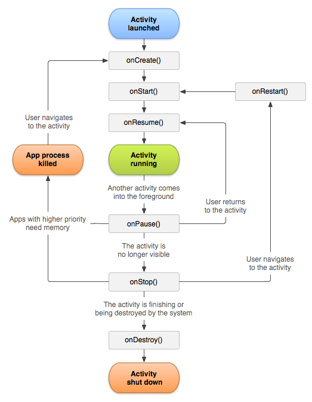

# Android

- Its kernel is based on modified version of Linux kernel.

## Application Framework

- It provides high-level services like:
  - Activity Manager: Manages the lifecycle of applications.
  - Window Manager: Manages the window of applications.
  - Content provider: Allows apps to publish and share data with other apps
  - Package Manager: responsible for object creation from app building blocks.
  - Telephony Manager: for managing all voice calls. for example, true caller listens all incoming connection and then shows whatever message it wants to show. API doing this is now deprecated for third party apps as it is a security risk.
  - Resource Manager: Manages non-code resources like strings, color, and layout files.
  - location manager: for managing location services.

## Android studio

### Main building blocks

1. Activity: It is a single screen in an app. It is like a window in a desktop application. It's the entry point of the app and top level UI component.
2. Services: It is a faceless component that runs in the background to perform long-running operations or to perform work for remote processes. It is like running song or downloading app in background.
3. Broadcast receivers: It is a component that responds to system-wide broadcast announcements. It is like a listener for intents. For example, when the battery is low, the system sends a broadcast message.
4. Content providers: It is a component that manages a shared set of app data. You can store the data in the file system, an SQLite database, on the web, or any other persistent storage location your app can access.

>> We still have no multi threading. all before runs in the main thread.
>> you wont create objects from the previous building blocks but the package manager will do that for you.

#### 1.Activity

- It is a single screen in an app. It is like a window in a desktop application. It's the entry point of the app and top level UI component.
- the app may have zero or more activities. zero activities means the app is running in the background without any UI.
- back stack: the activity that is currently running is at the top of the stack. when you press back button, the activity is popped from the stack and the previous activity is shown. Each app has its own back stack.
- To create a new activity, you need to create a new class that extends the Activity class but now we use AppCompatActivity class instead of Activity class to support older versions of android. It is a subclass of FragmentActivity class which is a subclass of Activity class.
- All functions in the activity class are callbacks. You override these functions to add your own functionality and the activity manager is the one who calls these functions.
- The activity lifecycle is managed by the activity manager. The activity manager calls the following functions in the following order:
  - onCreate(): in which you create the activity(UI).
  - onStart(): where the objects initialized prepare to be visible.
  - onResume(): here the activity is visible to the user and the activity is running.
  - onPause(): when the activity is partially visible and the user can't interact with where the resources are released.
  - onStop(): when the activity is no longer visible to the user but the object is still in memory.
  - onDestroy()

> when click icon an app is launched, the onCreate() is called, then onStart() then onResume() and the activity is visible to the user. when you press the home button, the onPause() is called and the activity is partially visible. when you press the back button, the onStop() is called and the activity is no longer visible to the user but the object is still in memory. when you press the back button again, the onDestroy() is called and the activity is destroyed.
>

- If you are using android 12 and newer, if you touches bach it is not grantee that the activity will be destroyed. it is just removed from the back stack. if you want to destroy the activity, you need to swipe the app from the recent apps.

> If you are in activity one and going to activity two, the activity one is paused then stopped and the activity two is created and started then resumed. if you press back button, the activity two is paused then stopped and the activity one is restarted() from the stopped state to start then resumed.
>
> on configuration change, localization or orientation change like rotating the screen, the activity is destroyed and recreated.
>
>if a dialog is shown, the activity is paused and the dialog is shown. if the dialog is dismissed, the activity is resumed.
>z
> if RAM is low the system may kill the activity to free up memory. if the user navigates back to the activity, the activity is recreated. to save the state of the activity, you can override the onSaveInstanceState() function and save the state in a bundle object. the bundle object is passed to the onCreate() function when the activity is recreated.
