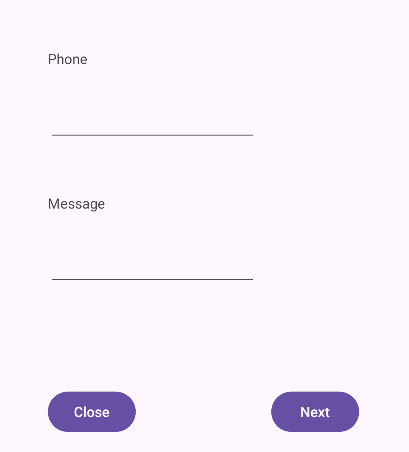
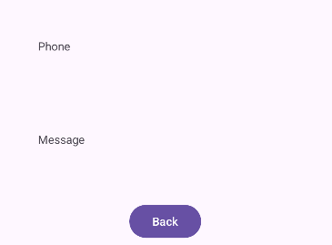

# How to create different orientations for a single activity in Android

## First Activity

1. Drop Your components in the layout file.
2. Change IDs.
3. Don't add strings in the layout file. Add them in the strings.xml file. How?
   1. While trying to add a string in the layout file, tap on the icon besides the text field.
   2. Press `+` to add a new resource to the module.
   3. Choose `string value` then add name and value.
4. Adjust the constraints of the components. at least two constraints are required for each component.
    1. For example, First component on the top left corner, set the top and left constraints.
    2. Then make all the other components left aligned to the first component.
       1. select both -> right click -> align left.
       2. and dont forget to add the top constraint.


## Second Activity

1. Create Second Activity: new -> Activity -> Empty views activity.
   > Dont mark the `Launcher Activity` checkbox.



## Landscape Orientation

- New -> layout resource file.
- Name it the same as portrait layout file.
- Orientation: landscape.

Add the components in the landscape layout file with the same IDs as the portrait layout file.

## Navigate Activities

1. Next button in the first activity.

   ```java
   Button nextBtn;
   nextBtn = findViewById(R.id.nextBtn);
        nextBtn.setOnClickListener(new View.OnClickListener() {
            @Override
            public void onClick(View view) {
                
            }
        });   
   ```

2. Intent to navigate to the next activity inside the onClick method.

   ```java
   Intent intent = new Intent(MainActivity.this, nextActivity.class);
   startActivity(intent);
   ```

3. Back button in the second activity.

   ```java
   Button backBtn;
   backBtn = findViewById(R.id.backBtn);
        backBtn.setOnClickListener(new View.OnClickListener() {
            @Override
            public void onClick(View view) {
                finish();
            }
        });
   ```

   > finish() method will destroy the current activity and navigate to the previous activity.

## Pack data from the first activity to the second activity

in the already created intent object, add the data from plain text fields editPhoneTxt and editMsgTxt.

1. Create EditText objects for the plain text fields.

   ```java
   EditText editPhoneTxt, editMsgTxt;
   editPhoneTxt = findViewById(R.id.editPhoneTxt);
   editMsgTxt = findViewById(R.id.editMsgTxt);
   ```

2. Retrieve the data from the plain text fields.

   ```java
   String phone = editPhoneTxt.getText().toString();
   String msg = editMsgTxt.getText().toString();
   ```

3. Add data to the intent object.

   ```java
   public static final String PHONE = "phone";
   public static final String MESSAGE = "message";

   public void onClick(View view) {
      String phone = editPhoneTxt.getText().toString();
      String message = editMsgTxt.getText().toString       
      
      Intent intent = new Intent(MainActivity.this, nextActivity.class);
      intent.putExtra(PHONE, phone);
      intent.putExtra(MESSAGE, message);
      startActivity(intent);
   }
   ```

## Retrieve data in the second activity

1. Create TextView objects for the text views.

   ```java
   TextView phoneTxt, msgTxt;
   phoneView = findViewById(R.id.phoneTxt);
   msgView = findViewById(R.id.msgTxt);
   ```

2. Retrieve the data from the intent object.

   ```java
   String phone = getIntent().getStringExtra(MainActivity.PHONE);
   String message = getIntent().getStringExtra(MainActivity.MESSAGE);
   ```

3. Set the data to the text views.

   ```java
   phoneView.setText(phone);
   msgView.setText(message);
   ```

## Close button simulates the back button in phone

```java
closeBtn.setOnClickListener(view -> moveTaskToBack(true));
```

If you want to close the app, use the finish() method instead.
