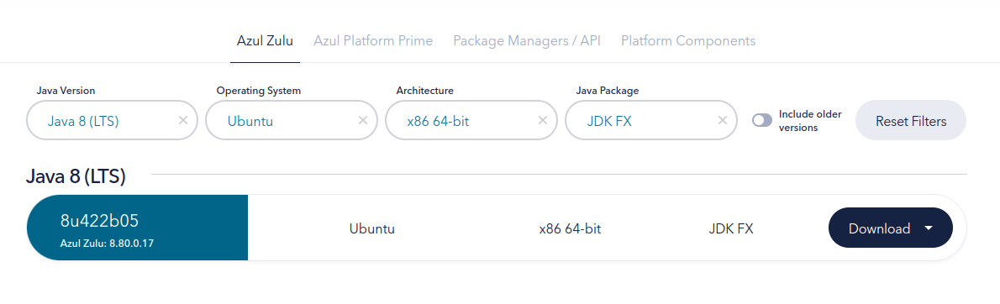

# Problems with Netbeans Setup Wth JavaFX On Ubuntu

1. Window pops up with the following error message while trying to install Netbeans:

    ```ERROR
    The JDK is missing and is required to run some NetBeans modules Please use the --jdkhome command line option to specify a JDK installation or see http://wiki.netbeans.org/FaqRunningOnJre for more information.
    ```

    **Solution:**

    - Open config file in the Netbeans installation directory.

    ```bash
    sudo nano /opt/netbeans-8.2/etc/netbeans.conf
    ```

    - Set `netbeans_jdkhome` to used JVM path then reopen Netbeans.

    ```bash
    netbeans_jdkhome="/usr/lib/jvm/java-8-openjdk-amd64"
    ```

2. When trying to create a new JavaFX project, the following error message appears with red color at the end of window blocking the project creation:

    ```ERROR
    Failed to automatically set-up a JavaFX Platform. Please go to Platform Manager, create a non-default Java SE platform, then go to the JavaFX tab, enable JavaFX and fill in the paths to valid JavaFX SDK and JavaFX Runtime. Note: JavaFX SDK can be downloaded from JavaFX website.
    ```

    **Solution:**

    - Download JavaFX SDK from [Azul website](https://www.azul.com/downloads/?version=java-8-lts&os=ubuntu&architecture=x86-64-bit&package=jdk-fx#zulu) setting required options for your case then download and extract the file.

    Options suitable for me:

    

    - Open Netbeans and go to `Tools` -> `Java Platforms` -> `Add Platform` -> `Java Standard Edition` -> `Next` -> `Browse` -> `Select the extracted JavaFX SDK folder` -> `Finish`.
    - Restart Netbeans and create a new JavaFX project again.
